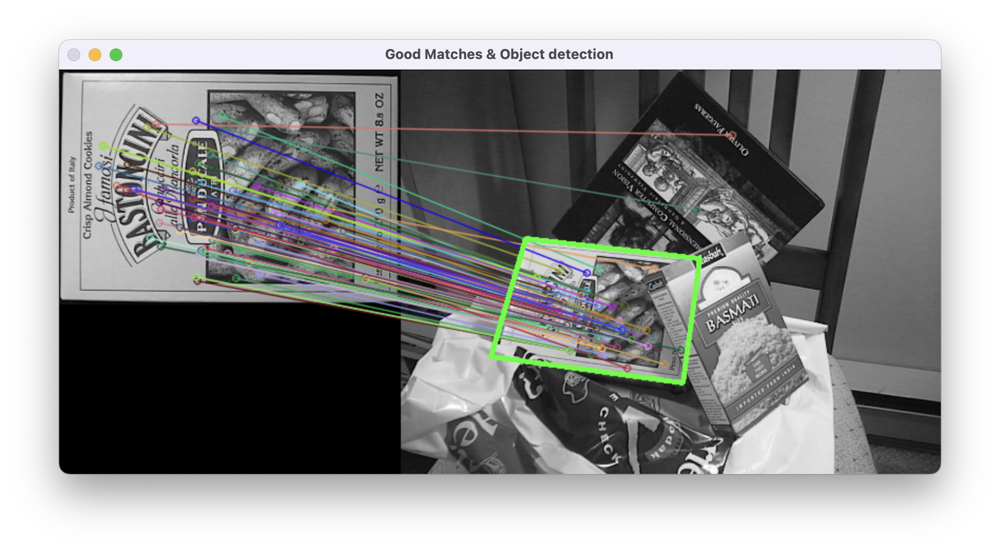

# OpenCV C++

This repository demonstrates how to set up and build an OpenCV project using C++. The example implements feature detection and homography to identify objects in images.

**Input images:**
* box.png: 


* box_in_scene.png: 

 

**Output image:**
* output.png: 


## Prerequisites

- OpenCV
> $ brew install opencv
> $ brew list --versions | grep opencv

- CMake
> $ brew install cmake

## Command Line

```
$ mkdir build
$ cd build
$ cmake .. .
$ make
$ cd ..
$ ./build/Main
```

For repeating building and running:
> $ cd build && cmake .. && make && cd .. && ./build/Main

If the image is displayed, it's OK.

Key points:
* To separate your source code from files generated by cmake build, create a build directory first, then run "cmake .. ." to execute CMakeLists.txt.
* Compile with "make" to generate ./Main.
* Since the image file needs to be in the same directory as the source code when running, "cd .." to go up one level, then execute "./build/Main".
